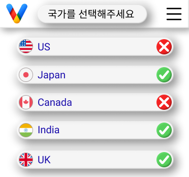
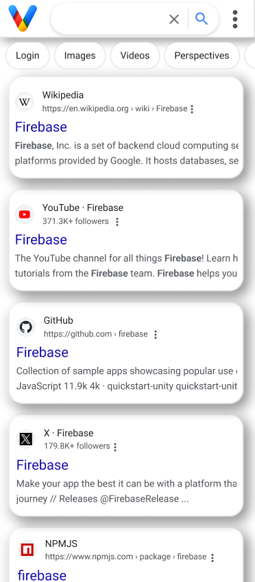

# 다국어 검색 및 번역 API for Google 확장 프로그램


https://youtu.be/jlPhVY2i200

[English](../README.md) | [日本語](./README.ja-jp.md)

이 API는 Google 확장 프로그램을 통해 다양한 언어로 검색 및 번역 기능을 제공합니다. DeepL API를 사용한 텍스트 번역, Google Custom Search Engine을 이용한 검색 결과 가져오기, Firebase Firestore 및 Realtime Database를 통한 데이터 관리 기능을 조합하여 제공합니다.

## 주요 기능

- **텍스트 번역**: DeepL API를 사용하여 지정된 텍스트를 대상 언어로 번역합니다.
- **검색 결과 가져오기**: Google Custom Search Engine을 사용하여 번역된 쿼리에 기반한 검색 결과를 가져옵니다.
- **Firebase에 결과 저장**: 가져온 검색 결과를 Firebase Firestore 및 Realtime Database에 저장합니다.
- **CORS 설정**: Flask-CORS를 사용하여 특정 출처의 접근을 허용합니다.
- **로그 관리**: 애플리케이션의 작동을 추적하고 문제 진단에 도움이 되도록 로깅을 설정합니다.

## 기술 스택

- **Flask**: 서버 사이드 애플리케이션 프레임워크.
- **Firebase Admin SDK**: Firebase 서비스(Firestore, Realtime Database)에 대한 접근을 제공합니다.
- **Google API Client Library**: Google Custom Search Engine과의 통신을 가능하게 합니다.
- **requests**: HTTP 요청을 보내기 위해 사용됩니다.
- **Flask-CORS**: 크로스 오리진 리소스 공유(CORS) 설정을 관리합니다.

## 설정 방법

1. 필요한 라이브러리 설치: `pip install flask flask-cors firebase-admin google-api-python-client requests`
2. Firebase 프로젝트 설정 및 서비스 계정 키 획득.
3. `.env` 파일 또는 환경 변수에 Google API 키, DeepL API 키, Firebase 서비스 계정 키 파일 경로를 설정합니다.
4. 애플리케이션 시작: `python app.py`

## 설치 방법

이 프로젝트를 사용하기 위해 필요한 패키지와 라이브러리를 설치하려면, 먼저 프로젝트의 루트 디렉토리에서 다음 명령어를 실행하여 `requirements.txt`에 명시된 모든 의존성을 설치해야 합니다.

```bash
pip install -r requirements.txt
```

```
firebase_admin==6.2.0
Flask==3.0.2
Flask_Cors==4.0.0
google_api_python_client==2.105.0
langchain_community==0.0.20
openai==0.27.10
Requests==2.31.0
```
## API 엔드포인트

- `/save-query`: POST 요청으로 검색 쿼리를 받아 처리하고 Firebase에 저장합니다.
- `/run-summary`: POST 요청으로 지정된 텍스트의 요약을 실행합니다.
- `/get-search-results`: GET 요청으로 저장된 검색 결과를 가져옵니다.
- `/update_country_status`: POST 요청으로 특정 국가의 상태를 업데이트합니다.


## 프로젝트 UI

이 섹션에서는 확장 프로그램의 사용자 인터페이스에 대해 설명합니다. 확장 프로그램은 사용자가 다양한 국가를 선택하여 검색 결과를 필터링할 수 있게 해주는 토글 스위치를 포함합니다.

### 국가 선택 토글

사용자는 아래 이미지에 표시된 것처럼 각 국가 옆에 있는 토글 스위치를 사용하여 활성화 또는 비활성화할 수 있습니다. 활성화된 국가는 API가 해당 국가의 검색 결과를 가져오고 저장합니다.



### 검색 결과 인터페이스

검색 결과 인터페이스는 사용자가 검색 쿼리를 입력하고, API를 통해 반환된 결과를 보여줍니다. 사용자는 검색 결과를 클릭하여 더 많은 정보를 얻을 수 있습니다.




## 문의

버그 보고나 기능 요청은 GitHub의 Issues를 통해 받습니다.

## Project tree.

```
Visto
├─ LICENSE
├─ plugin
│  ├─ assets
│  │  ├─ css
│  │  │  ├─ base.css
│  │  │  ├─ embedded-style.css
│  │  │  ├─ popup-style.css
│  │  │  └─ styles.css
│  │  ├─ img
│  │  │  ├─ embedded
│  │  │  │  ├─ 1.svg
│  │  │  │  ├─ 2.svg
│  │  │  │  ├─ 3.svg
│  │  │  │  ├─ image.png
│  │  │  │  └─ V.svg
│  │  │  ├─ main-logo
│  │  │  │  ├─ V.png
│  │  │  │  ├─ V3.png
│  │  │  │  └─ V3.svg
│  │  │  └─ popup
│  │  │     ├─ canada.svg
│  │  │     ├─ check.svg
│  │  │     ├─ china.svg
│  │  │     ├─ india.svg
│  │  │     ├─ Japan.svg
│  │  │     ├─ korea.svg
│  │  │     ├─ line.svg
│  │  │     ├─ uk.svg
│  │  │     ├─ US.svg
│  │  │     ├─ V.svg
│  │  │     └─ x.svg
│  │  └─ js
│  │     ├─ background.js
│  │     ├─ content.js
│  │     ├─ embedded-DB.js
│  │     ├─ embedded-main.js
│  │     └─ popup.js
│  ├─ embedded.html
│  ├─ home.html
│  ├─ manifest.json
│  ├─ popup.html
│  └─ README.md
├─ python
│  ├─ app.log
│  ├─ back-app.log
│  ├─ backup-app.py
│  ├─ data
│  │  ├─ all-data.json
│  │  └─ kpmg-39cf2-default-rtdb-export.json
│  ├─ gpt4_chat.py
│  ├─ gptsearch
│  │  ├─ db_control.py
│  │  ├─ summurize.py
│  │  ├─ totalSummurize.py
│  │  └─ __pycache__
│  │     ├─ db_control.cpython-310.pyc
│  │     ├─ link_search.cpython-310.pyc
│  │     ├─ read_db.cpython-310.pyc
│  │     ├─ summurize.cpython-310.pyc
│  │     ├─ summurize.cpython-311.pyc
│  │     ├─ totalSummurize.cpython-311.pyc
│  │     └─ update_db.cpython-310.pyc
│  ├─ gptsearch3
│  │  ├─ db_control.py
│  │  ├─ summurize.py
│  │  ├─ total_sum.py
│  │  └─ __pycache__
│  │     ├─ db_control.cpython-310.pyc
│  │     ├─ link_search.cpython-310.pyc
│  │     ├─ read_db.cpython-310.pyc
│  │     ├─ summurize.cpython-310.pyc
│  │     ├─ summurize.cpython-311.pyc
│  │     └─ update_db.cpython-310.pyc
│  ├─ key2.json
│  └─ __pycache__
│     ├─ gpt4_chat.cpython-310.pyc
│     └─ gpt4_chat.cpython-311.pyc
└─ README.md

```
